# PokemonTest

### Author: Hector Guadalupe Climaco Flores
### Email: hclimaco14@gmail.com
Meking a pokedex using pokeapi more information in https://pokeapi.co/

 Application created with clean architecture,to list, shearch and show details of pokemons, register user with email and Google authentication,

### The use of:

- Genericts
- Unit Test
- Dependecy injection
- Delegate
- Clousures
- Cocoa Pods 
- Firebase Authentication

## How use:

#### 1 Install cocoa pods

if your computer has apple m1 processor open the terminal with Rosseta

  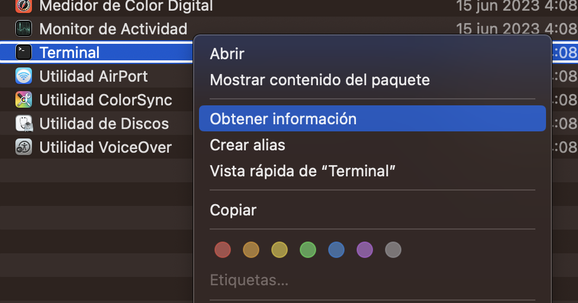

  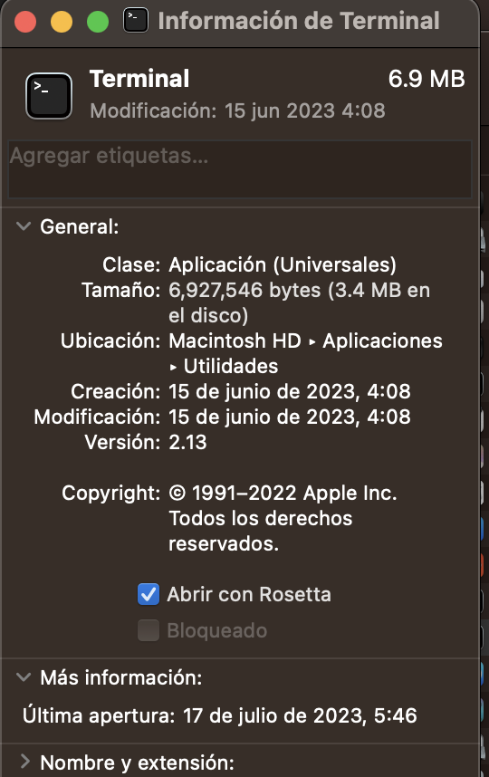

open the Terminal 

 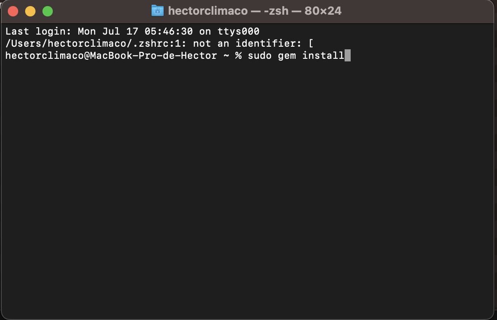

`sudo gem uninstall cocoapods`

#### 2 Move to location project in terminal and install pods

 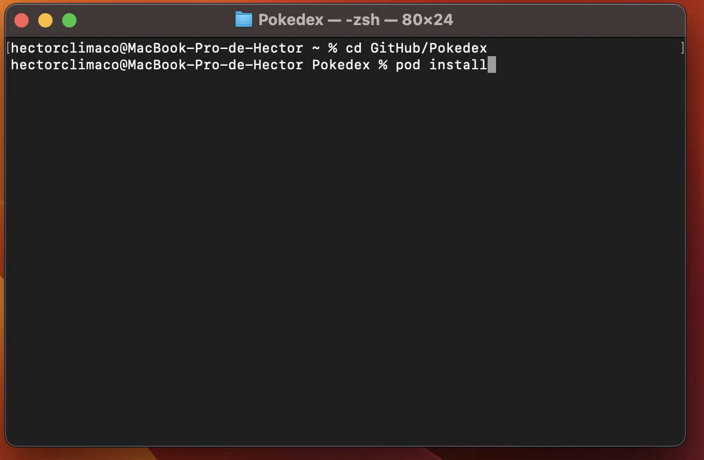

cd user/yourLocationProject/Pokedex
`pod install`

 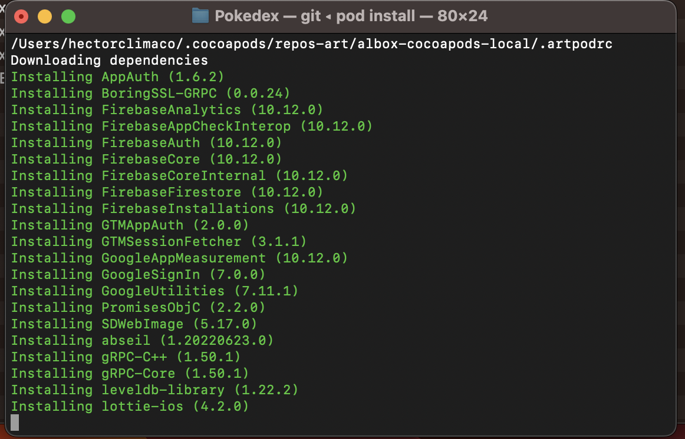

#### 3 open project with xcode
double click on the pokedex file with the extension .xcworkspace

 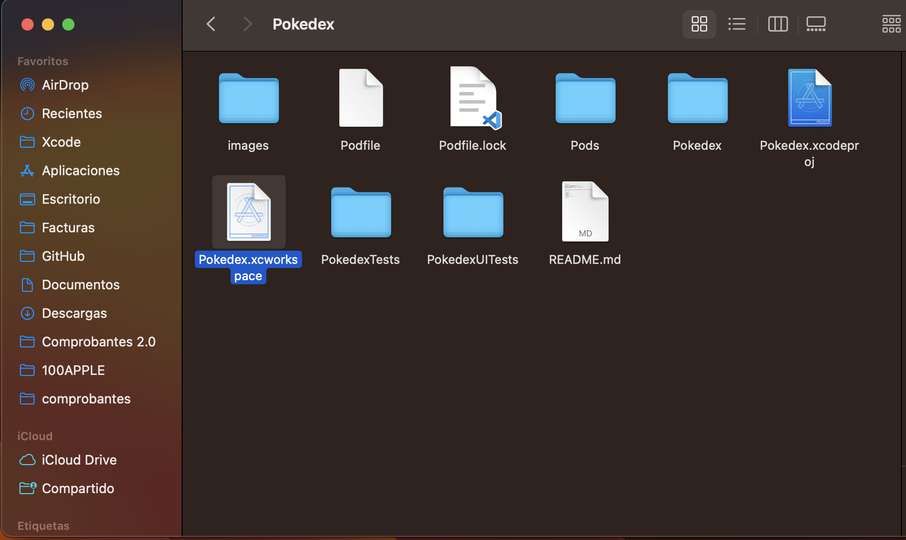

####4 select the project and choose the simulator

  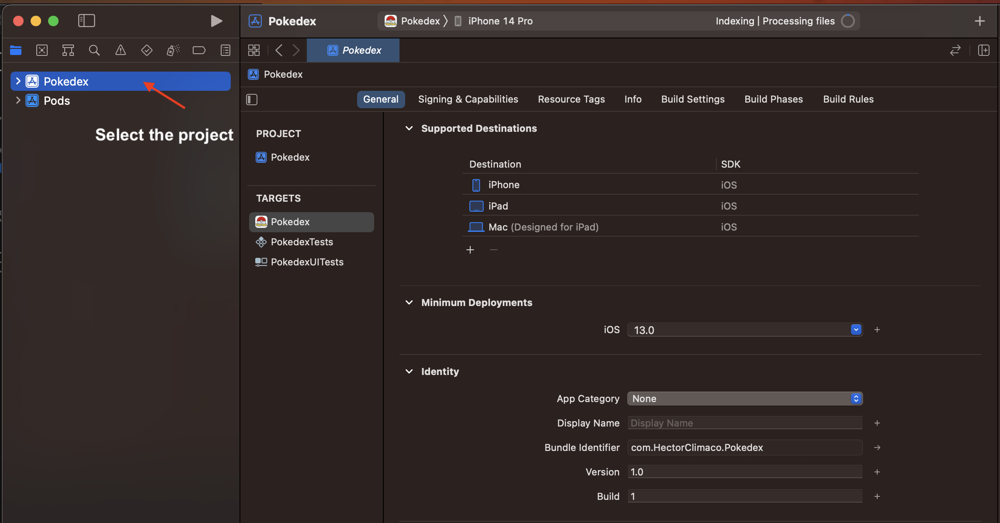
&nbsp; &nbsp; &nbsp; &nbsp;
  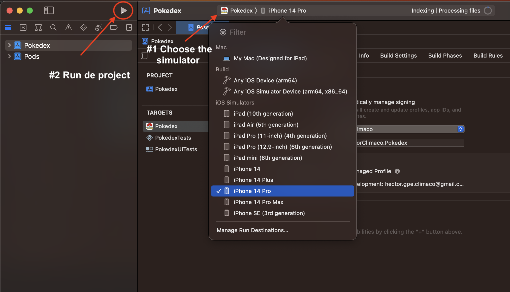

### application screemshots

  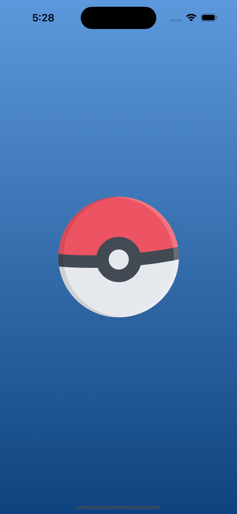
&nbsp; &nbsp; &nbsp; &nbsp;
  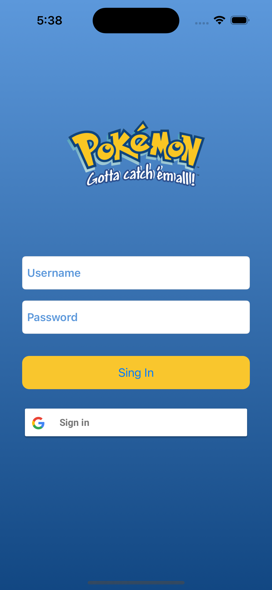

  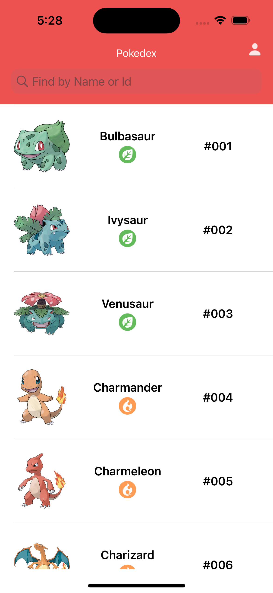
&nbsp; &nbsp; &nbsp; &nbsp;
  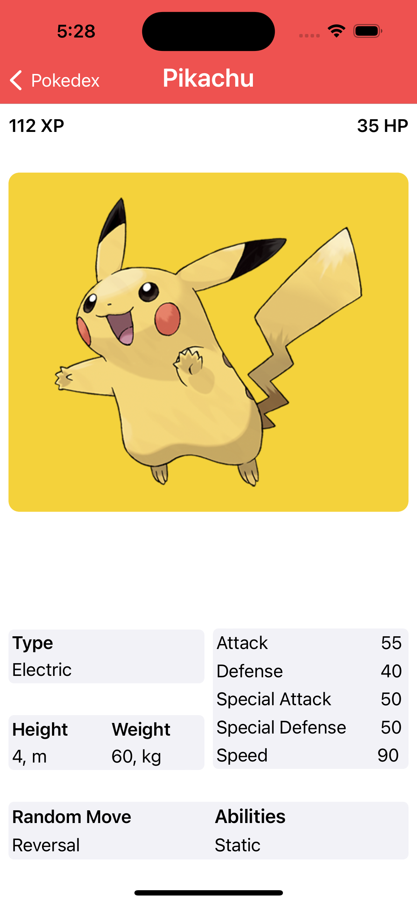

 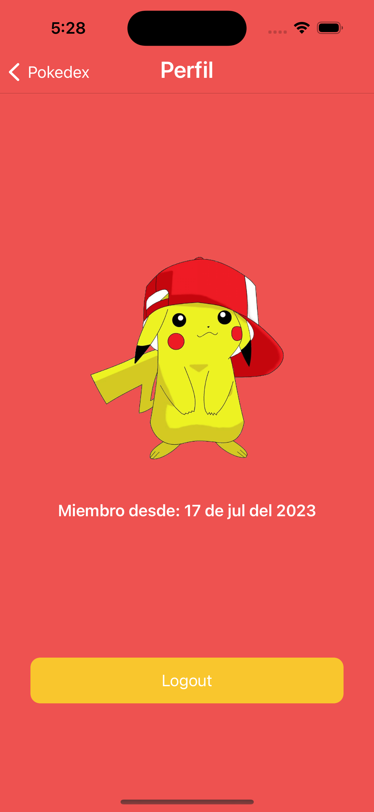

